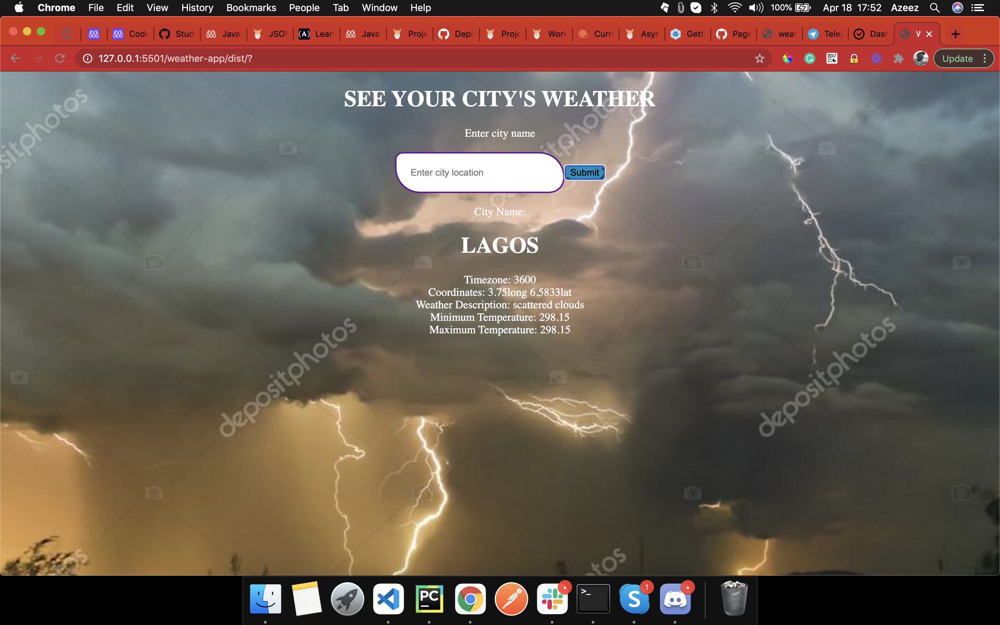

# weather-app

This project is to showcase my knowledge on webpack. It is an app that takes user location and returns the weather information

## Screenshot

Weatherapp List Landing Page

Weatherapp response page

## Description

A simple JS based App for todo list app.

## Setup
- Clone the project by running `git clone https://github.com/kunmi02/weather-app.git` on terminal or CMD
- Run terminal or CMD from the project directory.
-  Run `npm install`. If you do not have `npm` installed you can get it from [here](https://www.npmjs.com/).
- Run `npm start` to lauch a local web server and open a tab in you Browser with the page.

## Built With

- HTML 
- CSS
- Linter
- JS
- VScode
- Webpack
- LocalStorage

## Demo Link
https://kunmi02.github.io/weather-app/

## Contributing

Contributions, issues and feature requests are welcome! Start by:

  - Forking the project
  - Cloning the project to your local machine
  - cd into the project directory
  - Run git checkout -b your-branch-name
  - Make your contributions
  - Push your branch up to your forked repository
  - Open a Pull Request with a detailed description to the development branch of the original project for a review

## Author

👤 Azeez Ibrahim Akinkunmi 
Github: [@kunmi02](https://github.com/kunmi02)

## Show your Support
Give a ⭐ if you like this project!
